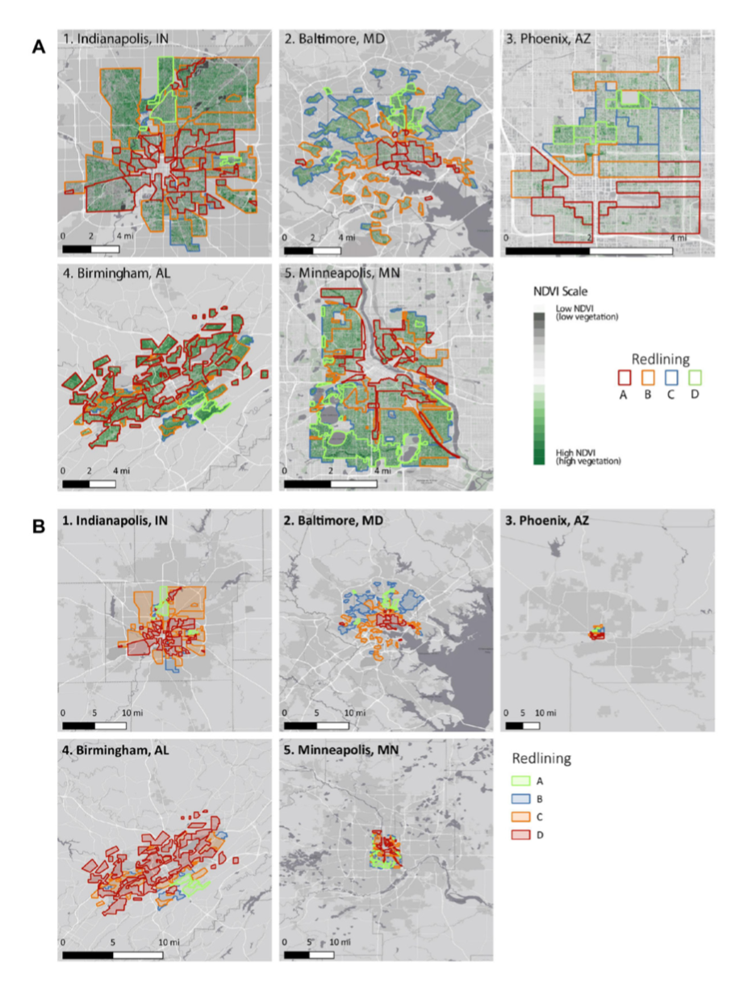

```{r setup, messages = FALSE, cache = FALSE, warning = FALSE}
knitr::opts_chunk$set(messages = FALSE, cache = FALSE, warning = FALSE)

# # Install and load required packages
# packages_to_install <- c("tmap", "terra", "tidyverse", "sf", "abind", "rstac", "gdalcubes", "stars", "jsonlite", "dplyr", "codetools")
# 
# # Check if the packages are installed, and if not, install them
# for (package in packages_to_install) {
#   if (!requireNamespace(package, quietly = TRUE)) {
#     install.packages(package)
#   }
# }


library(tmap)      #interactive maps, raster + vector layers
library(terra)       # Successor to the raster library
library(tidyverse)   # our old friend
library(sf)          # to work with simple features (vector) data
library(abind)
library(rstac)
library(gdalcubes, verbose = FALSE)
library(stars)
library(jsonlite)
library(dplyr)
library(codetools)
gdalcubes::gdalcubes_options(parallel = TRUE)
```

# Background

In August 2020, [Christopher Schell](http://directory.tacoma.uw.edu/employee/cjschell) and collegues published a review in *Science* on ['The ecological and evolutionary consequences of systemic racism in urban environments'](https://science.sciencemag.org/content/early/2020/08/12/science.aay4497) , showing how systematic racism and classism has significant impacts on ecological and evolutionary processes within urban environments. Here we explore a subset of the data used to support these findings in this review and the broader literature.

The [press release](https://www.washington.edu/news/2020/08/13/systemic-racism-has-consequences-for-all-life-in-cities/) on the paper is worth a read:

> "Racism is destroying our planet, and how we treat each other is essentially structural violence against our natural world," said lead author Christopher Schell, an assistant professor of urban ecology at the University of Washington Tacoma. "Rather than just changing the conversation about how we treat each other, this paper will hopefully change the conversation about how we treat the natural world."

In the paper, Schell writes:

> "In multiple cases, neighborhood racial composition can be a stronger predictor of urban socio-ecological patterns than wealth."

**Figure 2** in the Schell paper shows how NDVI (Normalized Difference Vegetation Index) tracks historical redlining. 

In this report, we explored one metric for how structural racism and classism underpin landscape heterogeneity in cities. We recreated the city map of San Francisco, and plot the distributions and mean vegetation patterns to explore the structural inequality and racism that Schell et al highlight in their paper. We used the following spatial data to do this:

**1.Mapping Inequality:**\
The introduction to the dataset we used is [here](https://dsl.richmond.edu/panorama/redlining/#loc=3/41.245/-105.469&text=intro). The "holc_grade" column represents the assigned grades to residential neighborhoods that reflected their "mortgage security" from minimal risk to being hazardous. We will then visualize these grades on color-coded maps.

```{r}
sfzip <-"https://dsl.richmond.edu/panorama/redlining/static/downloads/shapefiles/CASanFrancisco1937.zip"

sfurl <- paste0("/vsizip/vsicurl/",sfzip)
sf <- read_sf(sfurl)
sf
```

```{r}
tmap_mode("plot")
tm_shape(sf)+tm_polygons("holc_grade")
```

```{r}
## STAC Search over 400 million assets.
box <- c(xmin=-122.51, ymin=37.70, xmax=-122.35, ymax=37.82) 
start_date <- "2022-06-01"
end_date <- "2022-08-01"
items <- 
  stac("https://earth-search.aws.element84.com/v0/") |>
  stac_search(collections = "sentinel-s2-l2a-cogs",
              bbox = box,
              datetime = paste(start_date, end_date, sep="/"),
              limit = 100) |>
  post_request() 
```

```{r}
col <-
  stac_image_collection(items$features,
                        asset_names = c("B02", "B03", "B04","B08", "SCL"),
                        property_filter = \(x) {x[["eo:cloud_cover"]] < 20})
cube <- cube_view(srs = "EPSG:4326",  
                  extent = list(t0 = start_date, t1 = "2022-08-31",
                                left = box[1], right = box[3],
                                top = box[4], bottom = box[2]),
                  nx = 1000, ny = 1000, dt = "P1M",
                  aggregation = "median", resampling = "average")
```

```{r}
S2.mask <- image_mask("SCL", values=c(3,8,9)) # mask clouds and cloud shadows
raster_cube(col, cube, mask = S2.mask) |>
  select_bands(c("B04", "B03", "B02")) |>
  plot(rgb = 1:3)
```

```{r}
ndvi <- 
  raster_cube(col, cube, mask = S2.mask) |>
  select_bands(c("B08", "B04")) |>
  apply_pixel("(B08-B04)/(B08+B04)", "NDVI") |>
  aggregate_time("P3M") |>
  st_as_stars()
ave_ndvi <-
  raster_cube(col, cube, mask = S2.mask) |>
  select_bands(c("B08", "B04")) |>
  apply_pixel("(B08-B04)/(B08+B04)", "NDVI") |>
  aggregate_time("P3M") |>
  extract_geom(sf, FUN = mean )
ndvi
ave_ndvi
```

> "As you explore the materials Mapping Inequality, you will quickly encounter exactly that kind of language, descriptions of the"infiltration" of what were quite often described as "subversive," "undesirable," "inharmonious," or "lower grade" populations, for they are everywhere in the HOLC archive ....These grades were a tool for redlining: making it difficult or impossible for people in certain areas to access mortgage financing and thus become homeowners. Redlining directed both public and private capital to native-born white families and away from African American and immigrant families. As homeownership was arguably the most significant means of intergenerational wealth building in the United States in the twentieth century, these redlining practices from eight decades ago had long-term effects in creating wealth inequalities that we still see today. Mapping Inequality, we hope, will allow and encourage you to grapple with this history of government policies contributing to inequality."

**2.Normalized Difference Vegetation Index (NDVI)** (raster data) NDVI is used as proxy measure of vegetation health, cover and phenology (life cycle stage) over large areas. It is calculated using multiple bands from satellite images.

```{r}
ndvi2 <- ndvi |>st_as_stars()
ndvi2
```

# Map of current (2019) mean NDVI across city redlining from the 1950s.

```{r}
tm_shape(ndvi2) + tm_raster(style = "quantile") + tm_shape(sf) + tm_polygons("holc_grade", alpha = 0.5)
```

# Exercise 2

**Plot the average NDVI values in different neighborhoods as well as the distribution of pixel values across cities and neighborhoods. Show how the trends differ between cities.**

```{r}
ave_ndvi |> as_tibble()
sf2 <- sf |> rowid_to_column("FID")
sf2
ndvi_poly <- left_join(sf2 , ave_ndvi)
ndvi_poly
```

```{r}
tmap_mode("plot")
tm_basemap() + 
tm_shape(ndvi_poly) + tm_polygons("NDVI", palette = "Greens") + 
  tm_shape(ndvi_poly) + tm_text("holc_grade", size = 0.5)
```

```{r}
ndvi_poly |> as_tibble() |>
  group_by(holc_grade) |>
  summarise(mean_NDVI = mean(NDVI))
```

# Exercise 3:

**Explain why considering systematic inequity and racism is important in the context of global change and developing solutions to the biodiversity crisis.**

Considering the systematic inequality helps inform a more comprehensive understanding on the historical background of many environmental crisis today. For instance, despite climate change being a global environmental issue, systematic injustices and inequality has resulted in uneven harm against certain groups of people who are usually the least responsible for such crisis, and have minor financial or social influence. When developing solutions of biodiversity crisis, it's important to identify the most vulnerable regions/people that should be prioritized. Moreover, future solution including regeneration and sustainability should aim for redress the issues caused by historical inequality.


```{r}
fresno <-"https://dsl.richmond.edu/panorama/redlining/static/downloads/shapefiles/CAFresno1936.zip"

fsurl <- paste0("/vsizip/vsicurl/",fresno)
fs <- read_sf(fsurl)
fs
tmap_mode("plot")
tm_shape(fs)+tm_polygons("holc_grade")
```

```{r}
box <- st_bbox(fs)
start_date <- "2022-06-01"
end_date <- "2022-08-01"
items <- 
  stac("https://earth-search.aws.element84.com/v0/") |>
  stac_search(collections = "sentinel-s2-l2a-cogs",
              bbox = c(box),
              datetime = paste(start_date, end_date, sep="/"),
              limit = 100) |>
  post_request() 

col <-
  stac_image_collection(items$features,
                        asset_names = c("B02", "B03", "B04","B08", "SCL"),
                        property_filter = \(x) {x[["eo:cloud_cover"]] < 20})
fs_cube <- cube_view(srs = "EPSG:4326",  
                  extent = list(t0 = start_date, t1 = "2022-08-31",
                                left = box[1], right = box[3],
                                top = box[4], bottom = box[2]),
                  nx = 1000, ny = 1000, dt = "P1M",
                  aggregation = "median", resampling = "average")
```

```{r}
S2.mask <- image_mask("SCL", values=c(3,8,9)) # mask clouds and cloud shadows
raster_cube(col, fs_cube, mask = S2.mask) |>
  select_bands(c("B04", "B03", "B02")) |>
  plot(rgb = 1:3)
```

```{r}
fs_ndvi <- 
  raster_cube(col, fs_cube, mask = S2.mask) |>
  select_bands(c("B08", "B04")) |>
  apply_pixel("(B08-B04)/(B08+B04)", "NDVI") |>
  aggregate_time("P3M") |>
  st_as_stars()
```

```{r}
fs_ave_ndvi <-
  raster_cube(col, fs_cube, mask = S2.mask) |>
  select_bands(c("B08", "B04")) |>
  apply_pixel("(B08-B04)/(B08+B04)", "NDVI") |>
  aggregate_time("P3M") |>
  extract_geom(fs, FUN = mean)
fs_ndvi
fs_ave_ndvi
ndvi3 <- fs_ndvi |>st_as_stars()
ndvi3
tm_shape(ndvi3) + tm_raster(style = "quantile") + tm_shape(fs) + tm_polygons("holc_grade", alpha = 0.5)
```
```{r}
fs_ave_ndvi |> as_tibble()
fs2 <- fs |> rowid_to_column("FID")
fs2
ndvi_poly2 <- left_join(fs2 , fs_ave_ndvi)
ndvi_poly2
tmap_mode("plot")
tm_basemap() + 
tm_shape(ndvi_poly2) + tm_polygons("NDVI", palette = "Greens") + 
  tm_shape(ndvi_poly2) + tm_text("holc_grade", size = 0.5)
ndvi_poly2 |> as_tibble() |>
  group_by(holc_grade) |>
  summarise(mean_NDVI = mean(NDVI))
```


