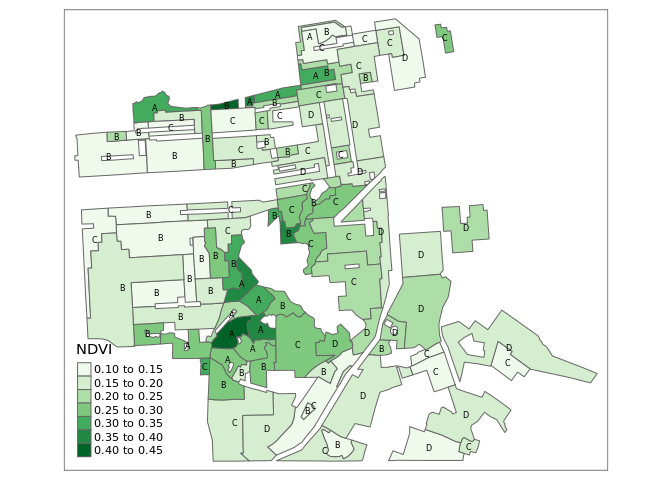

The ecological and evolutionary consequences of systemic racism
================
Millie Chapman (GSI)

``` r
#knitr::opts_chunk$set(messages = FALSE, cache = FALSE)

# remotes::install_deps()
library(tmap)      #interactive maps, raster + vector layers
```

    ## The legacy packages maptools, rgdal, and rgeos, underpinning the sp package,
    ## which was just loaded, were retired in October 2023.
    ## Please refer to R-spatial evolution reports for details, especially
    ## https://r-spatial.org/r/2023/05/15/evolution4.html.
    ## It may be desirable to make the sf package available;
    ## package maintainers should consider adding sf to Suggests:.

    ## Breaking News: tmap 3.x is retiring. Please test v4, e.g. with
    ## remotes::install_github('r-tmap/tmap')

``` r
library(terra)       # Successor to the raster library
```

    ## terra 1.7.55

``` r
library(tidyverse)   # our old friend
```

    ## ── Attaching packages ─────────────────────────────────────── tidyverse 1.3.0 ──

    ## ✔ ggplot2 3.4.4     ✔ purrr   1.0.2
    ## ✔ tibble  3.2.1     ✔ dplyr   1.1.3
    ## ✔ tidyr   1.3.0     ✔ stringr 1.5.0
    ## ✔ readr   2.1.4     ✔ forcats 1.0.0

    ## ── Conflicts ────────────────────────────────────────── tidyverse_conflicts() ──
    ## ✖ tidyr::extract() masks terra::extract()
    ## ✖ dplyr::filter()  masks stats::filter()
    ## ✖ dplyr::lag()     masks stats::lag()

``` r
library(sf)          # to work with simple features (vector) data
```

    ## Linking to GEOS 3.10.2, GDAL 3.4.1, PROJ 8.2.1; sf_use_s2() is TRUE

``` r
library(abind)
library(rstac)
library(gdalcubes)
```

    ## 
    ## Attaching package: 'gdalcubes'

    ## The following objects are masked from 'package:terra':
    ## 
    ##     animate, crop, size

``` r
library(stars)
gdalcubes::gdalcubes_options(parallel = TRUE)
```

## Learning objectives

This module provides an introduction to the fundamentals of working with
spatial vector and raster data in R while empirically exploring why
systematic and structural racism is interwined with urban ecological
processes. This module uses the Simple Features Access standard (ISO
19125) and tidyverse-style workflow using the sf package and emerging
ecosystem of r-spatial tools.

# Exercise

In August 2020, [Christopher
Schell](http://directory.tacoma.uw.edu/employee/cjschell) and collegues
published a review in *Science* on [‘The ecological and evolutionary
consequences of systemic racism in urban
environments’](https://science.sciencemag.org/content/early/2020/08/12/science.aay4497)
(DOI: 10.1126/science.aay4497), showing how systematic racism and
classism has significant impacts on ecological and evolutionary
processes within urban environments. Here we explore a subset of the
data used to support these findings in this review and the broader
literature.

The [press
release](https://www.washington.edu/news/2020/08/13/systemic-racism-has-consequences-for-all-life-in-cities/)
on the paper is worth a read:

> “Racism is destroying our planet, and how we treat each other is
> essentially structural violence against our natural world,” said lead
> author Christopher Schell, an assistant professor of urban ecology at
> the University of Washington Tacoma. “Rather than just changing the
> conversation about how we treat each other, this paper will hopefully
> change the conversation about how we treat the natural world.”

In the paper, Schell writes:

> “In multiple cases, neighborhood racial composition can be a stronger
> predictor of urban socio-ecological patterns than wealth.”

We are going to explore one metric for how structural racism and
classism underpin landscape heterogeneity in cities.

**Figure 2** in the Schell paper shows how NDVI (Normalized Difference
Vegetation Index) tracks historical redlining. 

We are going to recreate these city maps, and plot the distributions and
mean vegetation patterns across cities to explore the structural
inequality and racism that Schell et al highlight in their paper.

To do this we are going to use the following spatial data:

**1.Mapping Inequality:** (vector data)  
Please take the time to read the introduction to this dataset
[here](https://dsl.richmond.edu/panorama/redlining/#loc=3/41.245/-105.469&text=intro)

``` r
sfzip <-"https://dsl.richmond.edu/panorama/redlining/static/downloads/shapefiles/CASanFrancisco1937.zip"

sfurl <- paste0("/vsizip/vsicurl/",sfzip)
sf <- read_sf(sfurl)
sf
```

    ## # A tibble: 97 × 4
    ##    name  holc_id holc_grade                                             geometry
    ##    <chr> <chr>   <chr>                                        <MULTIPOLYGON [°]>
    ##  1 <NA>  A1      A          (((-122.4755 37.78687, -122.4755 37.78625, -122.476…
    ##  2 <NA>  A10     A          (((-122.4609 37.73566, -122.461 37.73572, -122.4613…
    ##  3 <NA>  A11     A          (((-122.4562 37.74046, -122.4566 37.74032, -122.456…
    ##  4 <NA>  A12     A          (((-122.4715 37.73326, -122.4665 37.73307, -122.465…
    ##  5 <NA>  A13     A          (((-122.461 37.73572, -122.4609 37.73566, -122.4605…
    ##  6 <NA>  A2      A          (((-122.4593 37.78795, -122.4598 37.78788, -122.459…
    ##  7 <NA>  A3      A          (((-122.4472 37.78954, -122.4485 37.78935, -122.454…
    ##  8 <NA>  A4      A          (((-122.446 37.80388, -122.4458 37.80235, -122.4456…
    ##  9 <NA>  A5      A          (((-122.4463 37.79187, -122.447 37.7966, -122.4463 …
    ## 10 <NA>  A6      A          (((-122.4731 37.7346, -122.4724 37.73464, -122.4723…
    ## # ℹ 87 more rows

``` r
tmap_mode("plot")
```

    ## tmap mode set to plotting

``` r
tm_shape(sf)+tm_polygons("holc_grade")
```

<!-- -->

``` r
## STAC Search over 400 million assets.
box <- c(xmin=-122.51006, ymin=37.70801, xmax=-122.36268, ymax=37.80668) 
start_date <- "2022-06-01"
end_date <- "2022-08-01"
items <- 
  stac("https://earth-search.aws.element84.com/v0/") |>
  stac_search(collections = "sentinel-s2-l2a-cogs",
              bbox = box,
              datetime = paste(start_date, end_date, sep="/"),
              limit = 100) |>
  post_request() 
```

``` r
col <-
  stac_image_collection(items$features,
                        asset_names = c("B02", "B03", "B04","B08", "SCL"),
                        property_filter = \(x) {x[["eo:cloud_cover"]] < 20})
```

    ## Warning in stac_image_collection(items$features, asset_names = c("B02", : STAC
    ## asset with name 'SCL' does not include eo:bands metadata and will be considered
    ## as a single band source

``` r
cube <- cube_view(srs = "EPSG:4326",  
                  extent = list(t0 = start_date, t1 = "2022-08-31",
                                left = box[1], right = box[3],
                                top = box[4], bottom = box[2]),
                  nx = 1000, ny = 1000, dt = "P1M",
                  aggregation = "median", resampling = "average")
```

``` r
S2.mask <- image_mask("SCL", values=c(3,8,9)) # mask clouds and cloud shadows

ndvi <- 
  raster_cube(col, cube, mask = S2.mask) |>
  select_bands(c("B08", "B04")) |>
  apply_pixel("(B08-B04)/(B08+B04)", "NDVI") |>
  aggregate_time("P3M") |>
  st_as_stars()
```

``` r
ndvi
```

    ## stars object with 3 dimensions and 1 attribute
    ## attribute(s), summary of first 1e+05 cells:
    ##             Min.    1st Qu.     Median       Mean   3rd Qu.      Max.
    ## NDVI  -0.6376002 -0.1380293 0.02614136 0.05817926 0.2067806 0.9047929
    ## dimension(s):
    ##      from   to offset      delta  refsys point                  values x/y
    ## x       1 1001 -122.5  0.0001474  WGS 84    NA                    NULL [x]
    ## y       1 1000  37.81 -9.867e-05  WGS 84    NA                    NULL [y]
    ## time    1    1     NA         NA POSIXct FALSE [2022-06-01,2022-09-01)

> “As you explore the materials Mapping Inequality, you will quickly
> encounter exactly that kind of language, descriptions of
> the”infiltration” of what were quite often described as “subversive,”
> “undesirable,” “inharmonious,” or “lower grade” populations, for they
> are everywhere in the HOLC archive ….These grades were a tool for
> redlining: making it difficult or impossible for people in certain
> areas to access mortgage financing and thus become homeowners.
> Redlining directed both public and private capital to native-born
> white families and away from African American and immigrant families.
> As homeownership was arguably the most significant means of
> intergenerational wealth building in the United States in the
> twentieth century, these redlining practices from eight decades ago
> had long-term effects in creating wealth inequalities that we still
> see today. Mapping Inequality, we hope, will allow and encourage you
> to grapple with this history of government policies contributing to
> inequality.”

**2.Normalized Difference Vegetation Index (NDVI)** (raster data) NDVI
is used as proxy measure of vegetation health, cover and phenology (life
cycle stage) over large areas. It is calculated using multiple bands
from satellite images.

``` r
ndvi2<-ndvi |>st_as_stars()
tmap_mode("plot")
```

    ## tmap mode set to plotting

# Exercise 1

**Create a map which shows current (2019) mean NDVI across city
redlining from the 1950s.**

``` r
tm_shape(ndvi2) + tm_raster(style = "quantile") + tm_shape(sf) + tm_polygons("holc_grade", alpha = 0.5)
```

    ## stars object downsampled to 1000 by 999 cells. See tm_shape manual (argument raster.downsample)

    ## Variable(s) "NA" contains positive and negative values, so midpoint is set to 0. Set midpoint = NA to show the full spectrum of the color palette.

    ## Some legend labels were too wide. These labels have been resized to 0.05, 0.05. Increase legend.width (argument of tm_layout) to make the legend wider and therefore the labels larger.

<!-- -->

# Exercise 2

**Plot the average NDVI values in different neighborhoods as well as the
distribution of pixel values across cities and neighborhoods. Show how
the trends differ between cities.**

# Exercise 3:

**Explain why considering systematic inequity and racism is important in
the context of global change and developing solutions to the
biodiversity crisis.**
